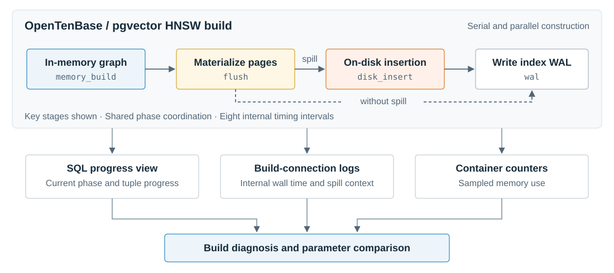
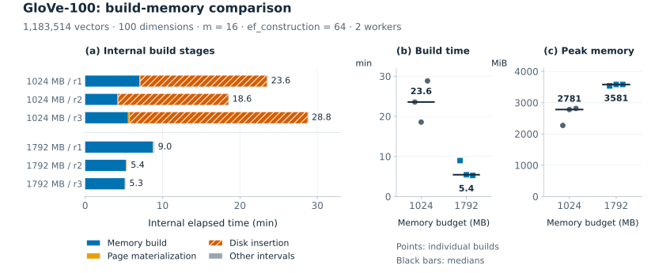

# OpenTenBase HNSW 构建诊断

本项目为 OpenTenBase 的 HNSW 索引构建提供**阶段观测、运行诊断与实验评估**。通过扩展 pgvector 的串行与并行构建路径，记录阶段进度、落盘信息和内部耗时，并结合资源采样与对照实验，支持分析内存、并行度及索引参数对构建成本和查询性能的影响。

基于 **OpenTenBase 18.6 / PG18 + pgvector 0.8.6**。

[使用文档](docs/usage.md) · [补丁说明](patches/pgvector/README.md) · [实验结果](docs/results.md) · [实验复现](benchmarks/README.md)

## 背景

HNSW 的索引构建涉及内存中的图构建、图的页面物化、落盘后的插入以及 WAL 写入。内存预算不足时，构建路径会发生变化，各阶段的耗时分布也随之改变。

上游项目已提供构建进度视图和内存不足告警，但仅凭这些信息，还看不清各个内部区间的耗时。本项目结合阶段进度、内部计时与资源采样，提供了更细粒度的观测数据，可用于分析构建瓶颈和对照参数的影响。

## 主要实现



<sup>**图 1. HNSW 构建的阶段观测与诊断。** 图中展示主要构建区间及有、无落盘时的路径；进度视图、构建连接日志和容器资源采样共同支持诊断与参数对照。</sup>

- **构建阶段扩展**：在 `pg_stat_progress_create_index` 中区分内存加载、刷盘、磁盘加载和 WAL 阶段，补充落盘时的内存与索引参数信息。数据库侧实现见 [pgvector C 补丁](patches/pgvector/pgvector.patch)。
- **内部计时与并行协调**：通过默认关闭的 `hnsw.build_timing` 记录八段内部耗时；利用共享状态协调并行构建阶段，由主进程统一发布进度与计时。
- **运行采样与诊断**：结合构建进度、内部计时、内存采样和构建参数生成诊断报告，支持只读观察已有构建会话。
- **参数与开销评估**：提供构建内存对照、调参集与独立验证集上的召回和延迟评估，以及原版与诊断版的交叉对照开销实验。
- **可复现实验**：提供固定版本源码准备、补丁安装、原版与诊断版镜像构建、数据下载、隔离运行和离线结果复算。

## 实验评估

我们使用 GloVe-100（1,183,514 条、100 维）与合成数据，评估阶段诊断能力、参数的影响和诊断补丁自身的开销。



<sup>**图 2. 增加构建内存消除了本组实验中的落盘后插入区间，同时提高了容器内存峰值。** 固定 `m=16`、`ef_construction=64` 与两个 worker，每档独立构建三次。(a) 展示每次构建的内部阶段耗时；(b)(c) 分别展示完整命令耗时与采样所得的容器内存峰值，点为单次结果，黑线为中位数。两组使用相同补丁，差异反映内存参数的影响。</sup>

| 实验 | 配置对照 | 主要结果 |
|---|---|---|
| GloVe 构建内存 | `maintenance_work_mem`：1024MB → 1792MB | 构建时间中位数 23.6 → 5.4 分钟；容器内存峰值中位数 2781 → 3581 MiB |
| GloVe 查询参数 | 固定 `m=16`、`ef_construction=128`，`ef_search`：400 → 1000 | 平均 Recall@10：91.13% → 95.47%；查询 p50：3.74 → 29.00ms |
| 诊断补丁开销 | 原版与诊断配置，覆盖串行／并行、有／无落盘 | 9/12 组比较的开销中位数统计上界低于 5%；其余三组并行条件的上界为 5.54%–7.86% |

内存对照每档运行三次；召回与延迟来自独立查询实验。数值对应所测环境与负载。

完整配置、结果与统计方法见[实验文档](docs/results.md)。原始测量和报告可从 [Releases](https://github.com/ccyoung3/opentenbase-hnsw-diagnostics/releases) 下载，复现步骤见[实验说明](benchmarks/README.md)。

## 快速开始

环境：**Python 3.11+、Git、Docker 和 Docker Compose**。镜像运行于 Linux ARM64；已验证 Apple Silicon Mac 的 Docker 环境。示例使用本机端口 `55432`。

**1. 获取项目，准备固定版本的源码**

```bash
git clone https://github.com/ccyoung3/opentenbase-hnsw-diagnostics.git
cd opentenbase-hnsw-diagnostics
python3 scripts/prepare_sources.py
```

源码准备脚本自动下载上游版本、应用补丁并检查源码；若源码目录已存在，脚本会拒绝覆盖。

**2. 构建运行镜像**

```bash
docker build --platform linux/arm64 --target runtime \
  -t opentenbase-pg18-pgvector:review-arm64 -f Dockerfile .
```

**3. 运行一个低内存案例**

```bash
python3 tools/hnsw/run.py \
  --isolated --image opentenbase-pg18-pgvector:review-arm64 \
  --build-timing --rows 10000 --dimensions 32 \
  --maintenance-work-mem 1MB --parallel-workers 0 \
  --statement-timeout-ms 180000 --label review-low
```

运行结束后，终端会给出结果目录。先打开 `diagnostic.md` 阅读诊断；`summary.json` 保存完整参数与结果，`progress.csv` 保存进度采样。本次临时数据库会自动清理。

接着将 `--maintenance-work-mem` 改为 `64MB`、`--label` 改为 `review-high` 再运行一次，即可比较落盘与耗时变化。详细步骤见[使用文档](docs/usage.md)，报告格式见 [5 万条合成数据示例](docs/example.md)。

## 开发验证

```bash
python3 -m venv .venv
source .venv/bin/activate
python3 -m pip install -r benchmarks/hnsw_build/requirements-glove.txt
python3 -m unittest discover -s tests -p 'test_*.py' -v
```

CI 运行 Python 测试，并检查补丁能否应用于固定版本的上游源码。
